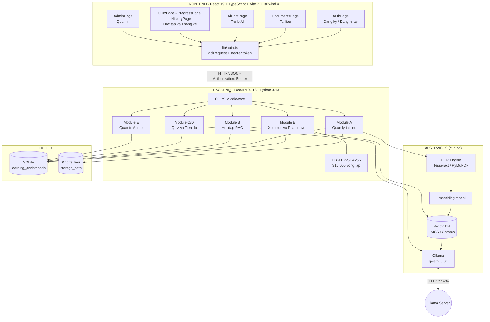
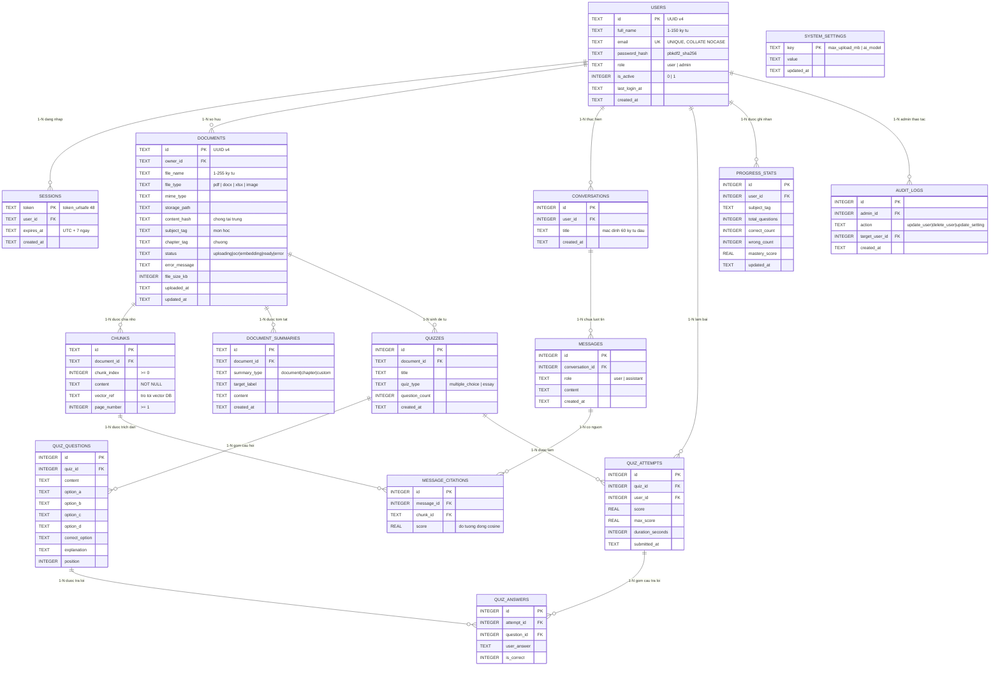
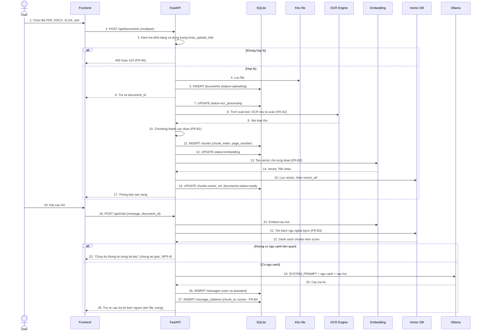
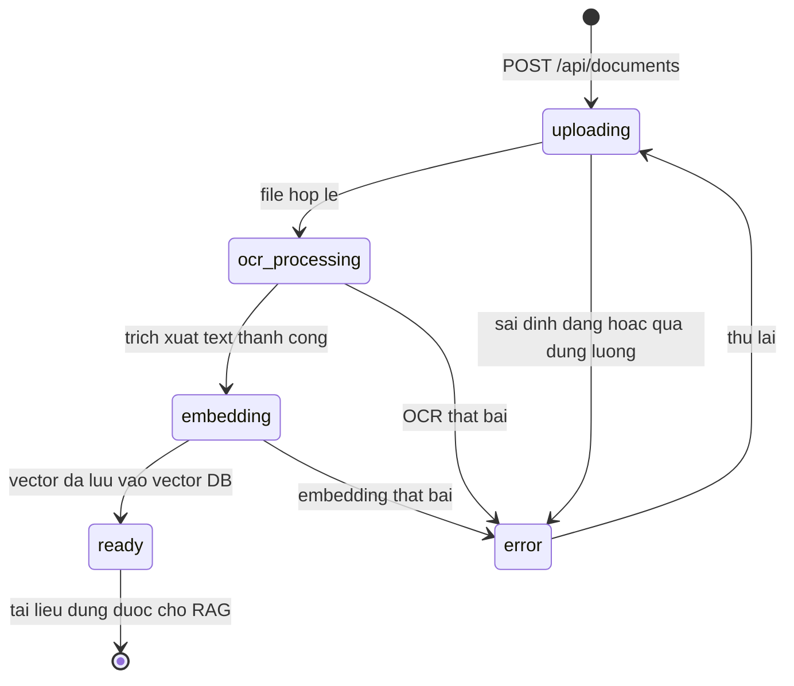
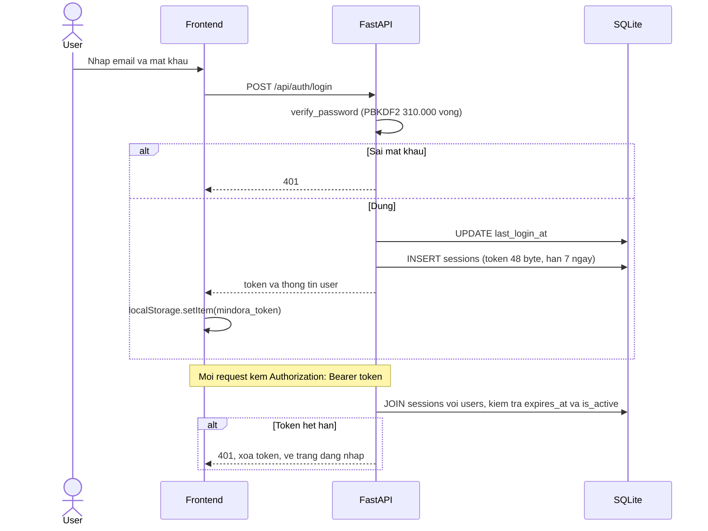

# THIẾT KẾ HỆ THỐNG — MINDORA

### Hệ thống Trợ lý ảo thông minh khai thác tài liệu và hỗ trợ học tập

| Mục | Nội dung |
|---|---|
| Tên dự án | ChatBotTroLiThongMinh (thương hiệu: **Mindora**) |
| Loại tài liệu | System Design Document (SDD) |
| Phiên bản | 1.0 |
| Ngày | 27/09/2026 |
| Mã nguồn | github.com/PhanTai227/ChatBotTroLiThongMinh — nhánh main, commit c9c87b3 |
| Tài liệu đầu vào | ĐẶC TẢ YÊU CẦU PHẦN MỀM.docx (SRS), Thiết kế CSDL - Trợ lý học tập AI.docx |
| Mã nguồn tham chiếu | schema.sql, backend/app/main.py, backend/requirements.txt, frontend/ |

---

## 1. Tổng quan hệ thống

### 1.1 Mục đích

Hệ thống cho phép người học tải tài liệu lên; hệ thống trích xuất, chia nhỏ và tạo vector đại diện cho nội dung; sau đó trả lời câu hỏi **dựa trên chính tài liệu người dùng** bằng công nghệ **RAG (Retrieval-Augmented Generation)**. Hệ thống đồng thời sinh quiz ôn tập, chấm điểm bài làm và theo dõi tiến độ học tập theo thời gian.

### 1.2 Phạm vi

Ứng dụng web độc lập (standalone), kiến trúc client–server, có thành phần AI backend riêng (OCR, embedding, vector search, LLM). Giai đoạn đầu **không tích hợp LMS có sẵn**.

### 1.3 Tác nhân

| Tác nhân | Mô tả | Quyền |
|---|---|---|
| **User** (Học viên) | Người học, tra cứu tài liệu, hỏi bài, làm quiz | Đăng ký, upload và quản lý tài liệu của chính mình, hỏi đáp, làm quiz, xem tiến độ cá nhân |
| **Admin** (Quản trị viên) | Quản trị hệ thống | Toàn bộ quyền User, quản lý tài liệu toàn hệ thống, quản lý tài khoản, cấu hình tham số, xem thống kê |
| **Hệ thống** (tự động) | Tiến trình nền | OCR, chunking, embedding, sinh quiz, chấm bài, cập nhật tiến độ |

### 1.4 Đặc điểm vận hành đặc thù — chạy hoàn toàn cục bộ (offline)

Đây là quyết định thiết kế quan trọng nhất, tách Mindora khỏi hệ thống LLM đám mây thông thường:

- LLM do **Ollama** phục vụ cục bộ tại `http://127.0.0.1:11434` (mặc định `qwen2.5:3b`).
- Vector database lưu cục bộ (FAISS/Chroma); SQLite **không lưu vector**, chỉ lưu `vector_ref` trỏ tới.
- Toàn bộ dữ liệu nằm trong **một file SQLite**: `backend/app/learning_assistant.db`.
- Không phụ thuộc dịch vụ trả phí, không cần Internet sau khi cài đặt, đáp ứng ràng buộc "hệ thống dùng LLM qua API, không tự huấn luyện model".
- Model nặng được tách thư mục riêng: `OLLAMA_MODELS=D:\TroLiThongMinh\ollama-models`.

---

## 2. Kiến trúc tổng thể

### 2.1 Sơ đồ khối

### 2.2 Công nghệ đã chọn

| Thành phần | Công nghệ | Phiên bản | Vị trí |
|---|---|---|---|
| Frontend | React + TypeScript + Vite | 19.1 / 5.8.3 / 7.0.4 | frontend/ |
| Giao diện | Tailwind CSS + lucide-react | 4.1.11 / 0.468 | frontend/src/ |
| Backend API | FastAPI | 0.116.1 | backend/app/main.py |
| ASGI Server | Uvicorn | 0.35.0 | start-local.ps1 |
| Validation | Pydantic | 2.11.7 | backend/app/main.py |
| HTTP Client | httpx | 0.28.1 | gọi Ollama |
| CSDL chính | SQLite3 (thư viện chuẩn) | — | learning_assistant.db |
| LLM | Ollama (qwen2.5:3b) | — | biến OLLAMA_MODEL |
| Băm mật khẩu | PBKDF2-HMAC-SHA256 | 310.000 vòng lặp | hash_password() |
| Khởi chạy | PowerShell | — | start-local.ps1 |

> **Ghi chú quyết định:** dùng `sqlite3` thay vì SQLAlchemy/PostgreSQL như SRS gợi ý, vì hệ thống chạy 1 tiến trình cục bộ, dữ liệu nhỏ, giảm phụ thuộc và đơn giản hoá bảo trì (NFR-7). Kiến trúc đã giữ nguyên ranh giới module nên khi cần mở rộng có thể chuyển sang PostgreSQL mà không phải đổi thiết kế lõi (NFR-2).

### 2.3 Quy ước giao tiếp

| Mục | Quy ước |
|---|---|
| Địa chỉ API | http://127.0.0.1:8000 (Swagger: /docs) |
| Địa chỉ Web | http://127.0.0.1:5173 |
| Xác thực | Header `Authorization: Bearer <token>` |
| Nơi lưu token | localStorage, khóa `mindora_token` |
| Lưu trữ session | 7 ngày (SESSION_DAYS = 7) |
| CORS | Cho phép origin 127.0.0.1:5173, localhost:5173 |
| Định dạng | JSON UTF-8, Pydantic validate đầu vào |
| Mã lỗi | 401 chưa đăng nhập/hết hạn; 403 sai vai trò/tài khoản bị khóa; 404 không tìm thấy; 409 trùng email; 502/503/504 lỗi dịch vụ AI |

---

## 3. MÔ HÌNH QUAN HỆ DỮ LIỆU (ERD)

### 3.1 Phân tích lược đồ hiện có

Dự án tồn tại **hai lớp lược đồ CSDL** chưa đồng nhất — đây là phát hiện quan trọng cần nêu trong báo cáo:

| Lớp | Nguồn | Các bảng | Trạng thái |
|---|---|---|---|
| **Lớp vận hành** | init_database() trong backend/app/main.py | users, sessions, system_settings, audit_logs, conversations, messages | **Đang chạy thực tế** |
| **Lớp thiết kế mở rộng** | schema.sql (thư mục gốc) | users, documents, chunks, document_summaries | **Thiết kế, chưa được nạp** |

**Xung đột cần lưu ý:**

| Điểm | schema.sql | main.py | Ảnh hưởng |
|---|---|---|---|
| Kiểu khóa users.id | TEXT (UUID v4 sinh bằng randomblob) | INTEGER AUTOINCREMENT | Không tương thích, cần script migrate |
| Thứ tự tạo bảng | users → documents → chunks → document_summaries | users → sessions → system_settings → audit_logs → conversations → messages | Hai bộ độc lập |
| Cột users.last_login_at | Có | Có | Không xung đột |
| Ràng buộc role | CHECK IN (user, admin) | CHECK IN (user, admin) | Nhất quán |

**Kết luận:** `schema.sql` mới là bản thiết kế CSDL đầy đủ cho nghiệp vụ tài liệu, còn `init_database()` mới là bản chạy thực tế cho nghiệp vụ chat và xác thực. Mô hình dưới đây là **mô hình hợp nhất hai lớp**, được dùng làm chuẩn.

### 3.2 ERD tổng quan

### 3.3 Bảng quan hệ (Relationship Table)

| # | Cha | Quan hệ | Con | Xóa | Ý nghĩa nghiệp vụ |
|---|---|---|---|---|---|
| 1 | users | 1–N | sessions | CASCADE | Một tài khoản có nhiều phiên đăng nhập (đa thiết bị) |
| 2 | users | 1–N | documents | CASCADE | Một người dùng sở hữu nhiều tài liệu |
| 3 | users | 1–N | conversations | CASCADE | Một người dùng có nhiều cuộc hội thoại |
| 4 | users | 1–N | quiz_attempts | CASCADE | Một người dùng làm nhiều lần thi |
| 5 | users | 1–N | progress_stats | CASCADE | Thống kê tiến độ theo từng môn học |
| 6 | users | 1–N | audit_logs | Hạn chế | Admin thao tác lên hệ thống |
| 7 | documents | 1–N | chunks | CASCADE | Tài liệu được chia thành nhiều đoạn |
| 8 | documents | 1–N | document_summaries | CASCADE | Tài liệu có nhiều bản tóm tắt |
| 9 | documents | 1–N | quizzes | CASCADE | Sinh nhiều bộ quiz từ một tài liệu |
| 10 | conversations | 1–N | messages | CASCADE | Hội thoại chứa nhiều lượt hỏi đáp |
| 11 | messages | 1–N | message_citations | CASCADE | Mỗi câu trả lời có nguồn trích dẫn |
| 12 | chunks | 1–N | message_citations | Hạn chế | Một đoạn được trích dẫn nhiều lần |
| 13 | quizzes | 1–N | quiz_questions | CASCADE | Bộ quiz gồm nhiều câu hỏi |
| 14 | quizzes | 1–N | quiz_attempts | CASCADE | Bộ quiz được làm nhiều lần |
| 15 | quiz_attempts | 1–N | quiz_answers | CASCADE | Một lần làm gồm nhiều câu trả lời |
| 16 | quiz_questions | 1–N | quiz_answers | Hạn chế | Câu hỏi được trả lời trong nhiều lần làm |

**Quan hệ nhiều-nhiều gián tiếp:** chunks và messages được hiện thực hoá bằng bảng trung gian `message_citations` (một đoạn có thể được trích dẫn ở nhiều câu trả lời; một câu trả lời có nhiều nguồn) — đây chính là cơ chế bảo đảm **FR-B4** (trích dẫn nguồn) và **NFR-4** (chống ảo giác).

### 3.4 Quy tắc nghiệp vụ gắn với quan hệ

| Mã | Quy tắc |
|---|---|
| **R1** | Mọi truy vấn documents phải lọc owner_id = user.id, trừ khi vai trò là admin (FR-A4, FR-A5, NFR-3) |
| **R2** | Xóa users sẽ xóa dây chuyền: documents → chunks → document_summaries, conversations → messages → message_citations, quiz_attempts → quiz_answers. Khi lên production nên chuyển sang soft-delete |
| **R3** | message_citations chỉ ghi khi câu trả lời có ngữ cảnh từ vector search; không tìm thấy ngữ cảnh liên quan thì phải trả lời "chưa đủ thông tin" thay vì trích dẫn sai (NFR-4) |
| **R4** | quiz_attempts là bảng ghi lịch sử bất biến (append-only), không sửa điểm sau khi nộp |
| **R5** | sessions.token là khoá chính, sinh ngẫu nhiên 48 byte, hạn 7 ngày, xóa khi logout hoặc khoá tài khoản hoặc đổi mật khẩu |
| **R6** | UNIQUE (document_id, chunk_index) đảm bảo thứ tự đoạn chia ổn định khi xử lý lại tài liệu |
| **R7** | content_hash (SHA-256) chống tải lại trùng tài liệu của cùng một người dùng |
| **R8** | progress_stats có UNIQUE (user_id, subject_tag), mỗi user một bản ghi môn học, cập nhật tăng dần bằng upsert |

### 3.5 Định nghĩa bảng chi tiết

#### 3.5.1 Bảng users — Người dùng

| Cột | Kiểu | Ràng buộc | Mô tả |
|---|---|---|---|
| id | TEXT | **PK**, UUID v4 | Định danh người dùng |
| full_name | TEXT | NOT NULL, 1–150 ký tự | Họ và tên |
| email | TEXT | NOT NULL, **UNIQUE**, COLLATE NOCASE, 4–150 ký tự, chứa @ | Email đăng nhập |
| password_hash | TEXT | NOT NULL, tối thiểu 20 ký tự | Định dạng pbkdf2_sha256$iterations$salt$digest |
| role | TEXT | NOT NULL, user hoặc admin | Vai trò phân quyền |
| is_active | INTEGER | NOT NULL, 0 hoặc 1 | Trạng thái khoá tài khoản |
| last_login_at | TEXT | NULL | Lần đăng nhập gần nhất |
| created_at | TEXT | NOT NULL | Thời điểm tạo |

#### 3.5.2 Bảng documents — Tài liệu

| Cột | Kiểu | Ràng buộc | Mô tả |
|---|---|---|---|
| id | TEXT | **PK**, UUID v4 | Định danh tài liệu |
| owner_id | TEXT | **FK → users(id)** ON DELETE CASCADE | Chủ sở hữu |
| file_name | TEXT | NOT NULL, 1–255 ký tự | Tên file gốc |
| file_type | TEXT | NOT NULL, pdf / docx / xlsx / image | Loại tài liệu (FR-A1) |
| mime_type | TEXT | NULL | MIME type thực tế |
| storage_path | TEXT | NOT NULL | Đường dẫn file trên đĩa |
| content_hash | TEXT | NULL | SHA-256 chống tải trùng |
| subject_tag | TEXT | NULL, tối đa 100 | Môn học (FR-A3) |
| chapter_tag | TEXT | NULL, tối đa 150 | Chương, mục (FR-A3) |
| status | TEXT | NOT NULL, uploading / ocr_processing / embedding / ready / error | Trạng thái xử lý |
| error_message | TEXT | NULL | Mô tả lỗi khi status = error |
| file_size_kb | INTEGER | NULL, lớn hơn bằng 0 | Dung lượng KB |
| uploaded_at | TEXT | NOT NULL | Thời điểm upload |
| updated_at | TEXT | NOT NULL | Thời điểm cập nhật |

#### 3.5.3 Bảng chunks — Đoạn văn bản (đơn vị truy hồi RAG)

| Cột | Kiểu | Ràng buộc | Mô tả |
|---|---|---|---|
| id | TEXT | **PK**, UUID v4 | Định danh đoạn |
| document_id | TEXT | **FK → documents(id)** ON DELETE CASCADE | Thuộc tài liệu |
| chunk_index | INTEGER | NOT NULL, lớn hơn bằng 0, **UNIQUE với document_id** | Thứ tự đoạn (FR-B1) |
| content | TEXT | NOT NULL, khác rỗng | Nội dung đoạn |
| vector_ref | TEXT | NULL | **Khoá tham chiếu tới vector trong FAISS/Chroma** (FR-B2) |
| page_number | INTEGER | NULL, lớn hơn bằng 1 | Số trang nguồn (FR-B4) |

#### 3.5.4 Bảng conversations, messages, message_citations — Hội thoại và trích dẫn

| Bảng | Cột | Kiểu | Ràng buộc | Mô tả |
|---|---|---|---|---|
| conversations | id | INTEGER | **PK** | Cuộc hội thoại |
| conversations | user_id | INTEGER | **FK → users(id)** CASCADE | Người sở hữu |
| conversations | title | TEXT | NOT NULL | Tiêu đề lấy từ 60 ký tự đầu câu hỏi |
| messages | id | INTEGER | **PK** | Lượt tin |
| messages | conversation_id | INTEGER | **FK → conversations(id)** CASCADE | Thuộc hội thoại |
| messages | role | TEXT | NOT NULL, user hoặc assistant | Người gửi |
| messages | content | TEXT | NOT NULL | Nội dung |
| messages | created_at | TEXT | NOT NULL | Thời điểm gửi |
| message_citations | id | INTEGER | **PK** | Bản ghi trích dẫn |
| message_citations | message_id | INTEGER | **FK → messages(id)** CASCADE | Câu trả lời được trích dẫn |
| message_citations | chunk_id | TEXT | **FK → chunks(id)** | Đoạn nguồn |
| message_citations | score | REAL | NULL | Điểm tương đồng cosine |

#### 3.5.5 Bảng quizzes, quiz_questions, quiz_attempts, quiz_answers — Bài tập và Quiz

| Bảng | Cột | Kiểu | Ràng buộc | Mô tả |
|---|---|---|---|---|
| quizzes | id | INTEGER | **PK** | Bộ quiz |
| quizzes | document_id | TEXT | **FK → documents(id)** CASCADE | Sinh quiz từ tài liệu |
| quizzes | title | TEXT | NULL | Tiêu đề bộ quiz |
| quizzes | quiz_type | TEXT | multiple_choice hoặc essay | Loại câu hỏi (FR-C1) |
| quizzes | question_count | INTEGER | NULL | Số câu hỏi |
| quiz_questions | id | INTEGER | **PK** | Câu hỏi |
| quiz_questions | quiz_id | INTEGER | **FK → quizzes(id)** CASCADE | Thuộc bộ quiz |
| quiz_questions | content | TEXT | NOT NULL | Nội dung câu hỏi |
| quiz_questions | option_a đến option_d | TEXT | NULL | 4 phương án trắc nghiệm |
| quiz_questions | correct_option | TEXT | NULL | Phương án đúng |
| quiz_questions | explanation | TEXT | NULL | Giải thích đáp án |
| quiz_questions | position | INTEGER | NULL | Thứ tự hiển thị |
| quiz_attempts | id | INTEGER | **PK** | Lần làm bài |
| quiz_attempts | quiz_id | INTEGER | **FK → quizzes(id)** CASCADE | Bộ quiz được làm |
| quiz_attempts | user_id | INTEGER | **FK → users(id)** CASCADE | Người làm bài |
| quiz_attempts | score | REAL | NULL | Điểm đạt (FR-C2) |
| quiz_attempts | max_score | REAL | NULL | Điểm tối đa |
| quiz_attempts | duration_seconds | INTEGER | NULL | Thời gian làm bài |
| quiz_answers | id | INTEGER | **PK** | Câu trả lời |
| quiz_answers | attempt_id | INTEGER | **FK → quiz_attempts(id)** CASCADE | Thuộc lần làm |
| quiz_answers | question_id | INTEGER | **FK → quiz_questions(id)** | Câu hỏi được trả lời |
| quiz_answers | user_answer | TEXT | NULL | Đáp án người dùng chọn |
| quiz_answers | is_correct | INTEGER | 0 hoặc 1 | Kết quả từng câu (FR-F3) |

#### 3.5.6 Bảng progress_stats — Tiến độ học tập

| Cột | Kiểu | Ràng buộc | Mô tả |
|---|---|---|---|
| id | INTEGER | **PK** | Định danh bản ghi |
| user_id | INTEGER | **FK → users(id)** CASCADE, UNIQUE với subject_tag | Người dùng |
| subject_tag | TEXT | NOT NULL | Môn học |
| total_questions | INTEGER | Lớn hơn bằng 0 | Tổng số câu đã làm |
| correct_count | INTEGER | Lớn hơn bằng 0 | Số câu đúng (FR-F3) |
| wrong_count | INTEGER | Lớn hơn bằng 0 | Số câu sai (FR-F3) |
| mastery_score | REAL | 0.0 đến 1.0 | Mức độ thành thạo bằng đúng chia tổng |
| updated_at | TEXT | NOT NULL | Cập nhật gần nhất (FR-F5) |

#### 3.5.7 Bảng system_settings, audit_logs — Cấu hình và nhật ký

| Bảng | Cột | Kiểu | Ràng buộc | Mô tả |
|---|---|---|---|---|
| system_settings | key | TEXT | **PK** | max_upload_mb (mặc định 20, FR-E5), ai_model (FR-E5) |
| system_settings | value | TEXT | NOT NULL | Giá trị cấu hình |
| system_settings | updated_at | TEXT | NOT NULL | Thời điểm sửa |
| audit_logs | id | INTEGER | **PK** | Định danh log |
| audit_logs | admin_id | INTEGER | **FK → users(id)** | Admin thực hiện |
| audit_logs | action | TEXT | NOT NULL | update_user, delete_user, update_setting |
| audit_logs | target_user_id | INTEGER | **FK → users(id)** | Đối tượng bị tác động |
| audit_logs | created_at | TEXT | NOT NULL | Thời điểm |

---

## 4. Đặc tả module chức năng

| Module | Nhóm FR | Trách nhiệm | Trạng thái |
|---|---|---|---|
| **E1. Xác thực** | FR-E1, E2 | Đăng ký, đăng nhập, phiên, phân quyền | Hoàn thành |
| **E2. Quản trị** | FR-E3, E4, E5 | Quản lý tài khoản, cấu hình, thống kê, audit | Hoàn thành |
| **B0. Chat AI** | FR-B1 đến B5 (mới phần) | Hỏi đáp qua LLM, lưu lịch sử hội thoại | Có chat, chưa có RAG |
| **A. Quản lý tài liệu** | FR-A1 đến A6 | Upload, OCR, gắn tag, tìm kiếm, xóa | Chỉ có giao diện |
| **B. RAG** | FR-B1 đến B5 | Chunking, embedding, semantic search, trích dẫn | Chưa triển khai |
| **C. Tóm tắt** | FR-B5 | Tóm tắt tài liệu, chương | Chưa triển khai |
| **D. Quiz** | FR-C1 đến C5 | Sinh đề, làm bài, chấm điểm | Chỉ có giao diện |
| **F. Tiến độ** | FR-F1 đến F5 | Lịch sử, thống kê, biểu đồ, gợi ý ôn tập | Chỉ có giao diện |

---

## 5. Đặc tả API (REST)

### 5.1 Xác thực

| Method | Endpoint | Body / Query | Trả về | Mã lỗi |
|---|---|---|---|---|
| POST | /api/auth/register | {full_name, email, password} | {token, user} | 409 trùng email, 422 sai định dạng |
| POST | /api/auth/login | {email, password} | {token, user} | 401 sai thông tin, 403 bị khoá |
| GET | /api/auth/me | Header Bearer | {user} | 401 hết hạn |
| POST | /api/auth/logout | Header Bearer | {message} | 401 |

**Ràng buộc đầu vào:** full_name từ 2 đến 150 ký tự; email từ 5 đến 150 ký tự; password từ 8 đến 128 ký tự.

### 5.2 Trợ lý AI

| Method | Endpoint | Body | Trả về | Mã lỗi |
|---|---|---|---|---|
| POST | /api/chat | {message, conversation_id} | {answer, conversation_id, model} | 401, 404, 502, 503, 504 |
| GET | /api/health | — | {status, ollama, model} | — |

**Tham số LLM:** temperature = 0.25 (ưu tiên chính xác học thuật); top_p = 0.9; num_predict = 600; keep_alive = 10m; timeout 180 giây.

### 5.3 Quản trị

| Method | Endpoint | Mô tả | Ghi log |
|---|---|---|---|
| GET | /api/admin/users | Danh sách tài khoản | — |
| PATCH | /api/admin/users | Đổi vai trò, khoá, đặt lại mật khẩu | Có, update_user |
| DELETE | /api/admin/users/{id} | Xóa tài khoản | Có, delete_user |
| GET | /api/admin/settings | Đọc cấu hình | — |
| PATCH | /api/admin/settings/{key} | Sửa max_upload_mb hoặc ai_model | Có, update_setting |
| GET | /api/admin/stats | Thống kê: users, active_users, conversations, questions | — |

### 5.4 API cần bổ sung (theo SRS)

| Method | Endpoint | Phục vụ FR |
|---|---|---|
| POST | /api/documents | FR-A1 |
| GET | /api/documents (lọc subject, q) | FR-A4 |
| PATCH, DELETE | /api/documents/{id} | FR-A4 |
| GET | /api/documents/{id}/status | FR-A2 (poll OCR, embedding) |
| POST | /api/chat (mở rộng thêm document_id) | FR-B3, FR-B4 |
| GET | /api/documents/{id}/summary | FR-B5 |
| POST | /api/quizzes/generate | FR-C1 |
| POST | /api/quizzes/{id}/submit | FR-C2 |
| GET | /api/progress | FR-F1 đến F5 |
| GET, DELETE | /api/conversations | FR-B6, FR-C5 |

---

## 6. Luồng nghiệp vụ chính

### 6.1 Luồng RAG — Từ tài liệu đến câu trả lời có trích dẫn

### 6.2 Máy trạng thái xử lý tài liệu

### 6.3 Luồng xác thực và phân quyền

### 6.4 Luồng sinh và chấm Quiz

Tài liệu ở trạng thái ready → lấy các chunk nổi bật → gửi prompt sinh N câu hỏi trắc nghiệm kèm đáp án và giải thích → lưu vào `quizzes` và `quiz_questions` → người dùng làm bài → `POST /api/quiz_attempts` → chấm điểm tự động → ghi vào `quiz_attempts` và `quiz_answers` → upsert `progress_stats` theo môn học → gợi ý môn có `mastery_score` thấp nhất để ôn lại (FR-F5).

---

## 7. Bảo mật

| Biện pháp | Chi tiết | NFR |
|---|---|---|
| Băm mật khẩu | PBKDF2-HMAC-SHA256, 310.000 vòng lặp, salt 16 byte ngẫu nhiên mỗi lần đăng ký | NFR-3 |
| So sánh thời gian hằng số | secrets.compare_digest chống tấn công kênh bên (timing) | NFR-3 |
| Token phiên | secrets.token_urlsafe(48), 384 bit entropy, khó đoán | NFR-3 |
| Hạn phiên | 7 ngày, kiểm tra expires_at ở mọi request | NFR-3 |
| Phân quyền | require_admin() kiểm tra role bằng admin ở mọi endpoint quản trị | NFR-3 |
| Chống tự khoá hoặc tự hạ quyền | Admin không thể khoá hoặc hạ quyền chính tài khoản đang đăng nhập | NFR-3 |
| Thu hồi phiên | Khoá tài khoản hoặc đổi mật khẩu sẽ xóa toàn bộ sessions của user | NFR-3 |
| Kiểm tra file upload | Kiểm tra định dạng và dung lượng theo max_upload_mb (FR-A6) | NFR-5 |
| XSS | React escape mặc định, không dùng dangerouslySetInnerHTML | NFR-3 |
| SQL Injection | Dùng tham số hoá câu truy vấn trong toàn bộ truy vấn sqlite3 | NFR-3 |
| Nhật ký hành động | audit_logs ghi lại mọi thao tác quản trị | FR-E4 |
| Ràng buộc LLM | System prompt yêu cầu không bịa, nói rõ khi thiếu thông tin | NFR-4 |

---

## 8. Yêu cầu phi chức năng và đo lường

| Mã | Loại | Yêu cầu | Cách đáp ứng | Chỉ số đo |
|---|---|---|---|---|
| NFR-1 | Hiệu năng | Trả lời trong 5 giây | Ollama cục bộ, keep_alive 10m để không tải lại model, timeout 180 giây | p95 thời gian phản hồi /api/chat |
| NFR-2 | Mở rộng | Mở rộng tài liệu và người dùng không đổi thiết kế lõi | Ranh giới module rõ ràng, schema.sql tách biệt, chuyển PostgreSQL dễ dàng | Số tài liệu, số user |
| NFR-3 | Bảo mật | Hash mật khẩu, phân quyền rõ, chống truy cập chéo tài liệu | Mục 7 | Số lỗ hổng phát hiện |
| NFR-4 | Chính xác | Trích dẫn nguồn, hạn chế ảo giác | message_citations, ngưỡng score, prompt chống bịa | Tỉ lệ câu trả lời có trích dẫn |
| NFR-5 | Khả dụng | Xử lý lỗi upload và AI gián đoạn | Máy trạng thái error kèm error_message, endpoint health check | Tỉ lệ lỗi 5xx |
| NFR-6 | Sử dụng | Giao diện đơn giản, dễ dùng | Tailwind responsive, sidebar trực quan, thông báo lỗi tiếng Việt | Thời gian học cách dùng |
| NFR-7 | Bảo trì | Module hóa theo nhóm A đến F | main.py tách theo nhóm chức năng | Thời gian thêm tính năng mới |

---

## 9. Phân tích khoảng cách và lộ trình triển khai

### 9.1 Nhận thức về sai lệch hai lớp CSDL

`schema.sql` và `init_database()` đang tồn tại song song với kiểu khoá `users.id` khác nhau (TEXT so với INTEGER). Cần chọn **một nguồn sự thật duy nhất** và viết script migration (`schema_migration_v2.sql`) để hợp nhất trước khi phát triển tiếp module tài liệu.

### 9.2 Trạng thái hiện thực

| Nhóm | Mức độ | Ghi chú |
|---|---|---|
| E — Xác thực và phân quyền | 100% | Register, Login, Logout, /me, session 7 ngày |
| E — Quản trị | 100% | Quản lý user, settings, stats, audit log |
| B — Chat AI | 50% | Có /api/chat và lưu lịch sử, thiếu RAG, chưa dùng documents |
| A — Tài liệu | 10% | DocumentsPage chỉ dùng useState mock, chưa có API upload |
| B — RAG | 0% | Chưa có module chunking, embedding, vector search |
| C — Tóm tắt | 0% | — |
| D — Quiz | 10% | QuizPage mock |
| F — Tiến độ | 10% | ProgressPage, HistoryPage mock, data.ts là số liệu tĩnh |

### 9.3 Lộ trình đề xuất

| Giai đoạn | Nội dung | Ưu tiên |
|---|---|---|
| **1. Chuẩn hoá CSDL** | Hợp nhất schema.sql và init_database(), thêm bảng còn thiếu, viết script migration | Cao |
| **2. Module A — Tài liệu** | Upload multipart, kiểm tra định dạng và dung lượng, lưu file, OCR, gắn tag, tìm kiếm | Cao |
| **3. Module B — RAG** | Chunking, Embedding, FAISS/Chroma, semantic search, prompt có ngữ cảnh, message_citations | Cao |
| **4. Module C — Tóm tắt** | Sinh document_summaries theo chương | Trung bình |
| **5. Module D — Quiz** | Sinh câu hỏi từ tài liệu, lưu quizzes, chấm điểm | Trung bình |
| **6. Module F — Tiến độ** | Ghi quiz_attempts, upsert progress_stats, biểu đồ, gợi ý ôn tập | Trung bình |
| **7. Tái lập kết nối FE** | Thay mock bằng apiRequest() cho 4 trang còn lại | Trung bình |
| **8. Nâng cấp** | Streaming câu trả lời qua SSE, Docker, sao lưu CSDL | Thấp |

### 9.4 Rủi ro dự kiến

| Rủi ro | Mức | Giảm thiểu |
|---|---|---|
| Hiệu năng LLM cục bộ trên máy yếu | Trung bình | Giảm num_predict, dùng model 3B, bật keep_alive |
| Sai lệch hai lớp CSDL gây mất dữ liệu | Cao | Giai đoạn 1, hợp nhất và sao lưu trước khi migrate |
| Ảo giác của LLM | Trung bình | RAG, trích dẫn, ngưỡng score, prompt chống bịa (NFR-4) |
| OCR tiếng Việt kém chính xác | Trung bình | Tesseract với language pack vie, ghi log lỗi chi tiết |
| SQLite ghi đồng thời bị khoá | Thấp | WAL mode, BEGIN IMMEDIATE, PRAGMA foreign_keys=ON |
| Mất dữ liệu khi xóa user | Trung bình | Cân nhắc soft-delete, sao lưu định kỳ |

---

## 10. Kết luận

Mindora là hệ thống trợ lý học tập AI **chạy hoàn toàn cục bộ** trên nền FastAPI và React, với 15 thực thể dữ liệu tổ chức theo 4 nhóm nghiệp vụ rõ ràng: **người dùng và phân quyền**, **tài liệu và khai thác tri thức**, **hội thoại và trích dẫn**, **học tập và tiến độ**. Kiến trúc 3 tầng (Frontend, Backend API, AI Services) với ranh giới module rõ ràng đáp ứng NFR-2 và NFR-7, cho phép mở rộng từ SQLite lên PostgreSQL và từ FAISS lên Chroma hay Pinecone mà không thay đổi thiết kế lõi. Nhánh nghiệp vụ **Xác thực và Quản trị** đã hoàn chỉnh; nhánh **RAG khai thác tài liệu** là trọng tâm phát triển tiếp theo, bắt đầu bằng việc chuẩn hoá hợp nhất hai lớp lược đồ CSDL.

