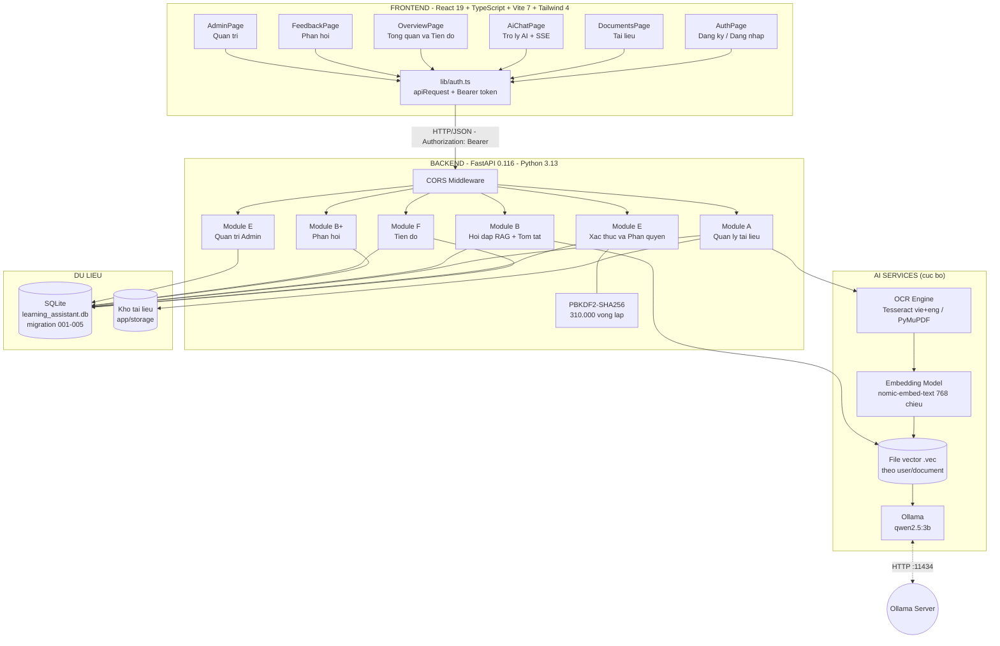
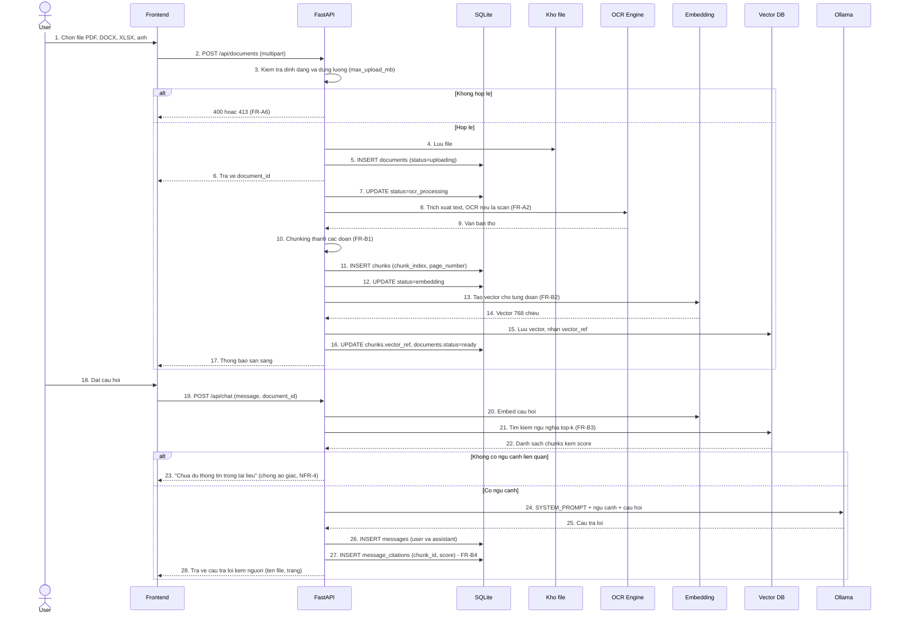
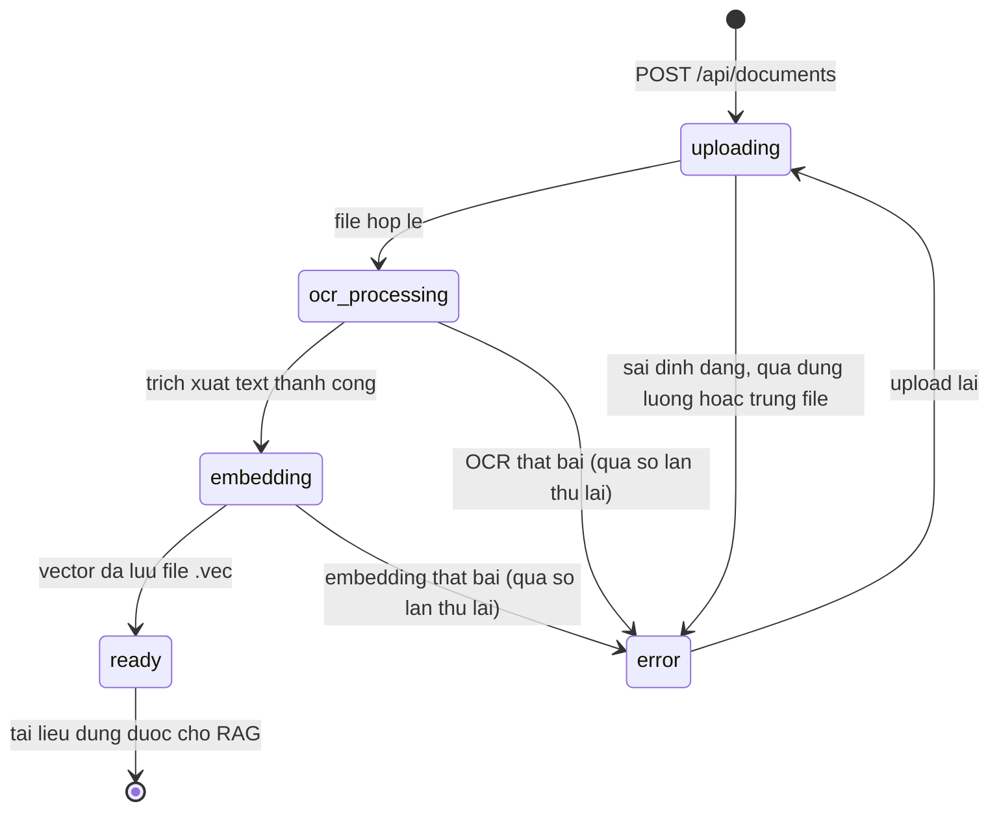
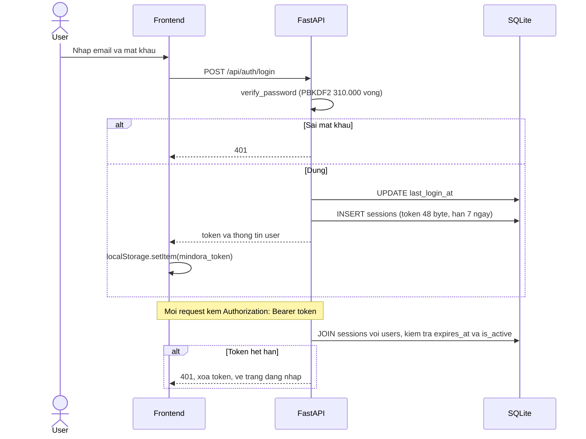

# THIẾT KẾ HỆ THỐNG — MINDORA

### Hệ thống Trợ lý ảo thông minh khai thác tài liệu và hỗ trợ học tập

| Mục | Nội dung |
|---|---|
| Tên dự án | ChatBotTroLiThongMinh (thương hiệu: **Mindora**) |
| Loại tài liệu | System Design Document (SDD) |
| Phiên bản | 2.0 (viết lại theo code thực tế) |
| Ngày | 08/10/2026 |
| Mã nguồn | github.com/PhanTai227/ChatBotTroLiThongMinh — nhánh feat/phase-0-1-foundation |
| Tài liệu đầu vào | ĐẶC TẢ YÊU CẦU PHẦN MỀM.docx (SRS), Thiết kế CSDL - Trợ lý học tập AI.docx |

> **Thay đổi phạm vi so với SRS gốc:** module **Quiz/Bài tập** (FR-C, các bảng
> `quizzes`, `quiz_questions`, `quiz_attempts`, `quiz_answers`) đã **bị loại bỏ**
> khỏi hệ thống (migration `005_remove_quizzes_add_feedback`). Tiến độ học tập
> được tính theo **số câu hỏi đã đặt**, không theo điểm quiz. Thay vào đó là module
> **Phản hồi** (học viên gửi đánh giá → admin trả lời). Mọi mục dưới đây mô tả
> đúng code hiện tại, các chức năng đã cắt được ghi rõ trong lịch sử thay đổi (mục 10).

---

## 1. Tổng quan hệ thống

### 1.1 Mục đích

Hệ thống cho phép người học tải tài liệu lên; hệ thống trích xuất, chia nhỏ và tạo vector đại diện cho nội dung; sau đó trả lời câu hỏi **dựa trên chính tài liệu người dùng** bằng công nghệ **RAG (Retrieval-Augmented Generation)** kèm trích dẫn nguồn. Hệ thống đồng thời theo dõi tiến độ học tập (số câu hỏi đã đặt theo từng môn) và tiếp nhận phản hồi của học viên gửi quản trị viên.

### 1.2 Phạm vi

Ứng dụng web độc lập (standalone), kiến trúc client–server, có thành phần AI chạy cục bộ (OCR, embedding, vector search, LLM). Giai đoạn đầu **không tích hợp LMS có sẵn**. **Ngoài phạm vi:** sinh quiz/bài tập, chấm điểm, xuất hội thoại ra file — các chức năng này có trong SRS gốc nhưng đã bị cắt (xem mục 10).

### 1.3 Tác nhân

| Tác nhân | Mô tả | Quyền |
|---|---|---|
| **User** (Học viên) | Người học, tra cứu tài liệu, hỏi bài | Đăng ký, upload và quản lý tài liệu của chính mình, hỏi đáp, xem tiến độ cá nhân, gửi phản hồi |
| **Admin** (Quản trị viên) | Quản trị hệ thống | Toàn bộ quyền User, quản lý tài khoản, cấu hình tham số, xem thống kê, trả lời phản hồi |
| **Hệ thống** (tự động) | Tiến trình xử lý tài liệu | OCR, chunking, embedding, tóm tắt, cập nhật tiến độ |

### 1.4 Đặc điểm vận hành đặc thù — chạy hoàn toàn cục bộ (offline)

Đây là quyết định thiết kế quan trọng nhất, tách Mindora khỏi hệ thống LLM đám mây thông thường:

- LLM do **Ollama** phục vụ cục bộ tại `http://127.0.0.1:11434` (mặc định `qwen2.5:3b`).
- Vector embedding (768 chiều, model `nomic-embed-text`) **lưu thành file nhị phân trong `app/storage/vectors/<user_id>/<document_id>.vec`**, không dùng FAISS/Chroma; SQLite chỉ lưu `vector_ref` là đường dẫn tới file vector.
- Toàn bộ dữ liệu nghiệp vụ nằm trong **một file SQLite**: `backend/app/learning_assistant.db`, khởi tạo bằng migration (`backend/app/migrations/001–005`).
- Không phụ thuộc dịch vụ trả phí, không cần Internet sau khi cài đặt, đáp ứng ràng buộc "hệ thống dùng LLM qua API, không tự huấn luyện model".
- Model nặng được tách thư mục riêng: `OLLAMA_MODELS=D:\TroLiThongMinh\ollama-models`.

---

## 2. Kiến trúc tổng thể

### 2.1 Sơ đồ khối



### 2.2 Công nghệ đã chọn

| Thành phần | Công nghệ | Phiên bản | Vị trí |
|---|---|---|---|
| Frontend | React + TypeScript + Vite | 19.1 / 5.8.3 / 7.0.4 | frontend/ |
| Giao diện | Tailwind CSS + lucide-react | 4.1.11 / 0.468 | frontend/src/ |
| Backend API | FastAPI | 0.116.1 | backend/app/main.py |
| ASGI Server | Uvicorn | 0.35.0 | start-local.ps1 |
| Validation | Pydantic v2 | 2.11.7 | backend/app/schemas.py |
| HTTP Client | httpx | 0.28.1 | gọi Ollama |
| CSDL chính | SQLite3 (thư viện chuẩn) + migration | — | learning_assistant.db, backend/app/migrations/001–005 |
| LLM | Ollama (qwen2.5:3b) | — | biến OLLAMA_MODEL |
| Embedding | Ollama (nomic-embed-text, 768 chiều) | — | biến EMBEDDING_MODEL, lưu file .vec |
| OCR | Tesseract portable (vie+eng) + PyMuPDF | — | tools/tesseract, biến TESSERACT_CMD |
| Băm mật khẩu | PBKDF2-HMAC-SHA256 | 310.000 vòng lặp | security.hash_password() |
| Khởi chạy | PowerShell | — | start-local.ps1 |

> **Ghi chú quyết định:** dùng `sqlite3` thay vì SQLAlchemy/PostgreSQL như SRS gợi ý, vì hệ thống chạy 1 tiến trình cục bộ, dữ liệu nhỏ, giảm phụ thuộc và đơn giản hoá bảo trì (NFR-7). Vector lưu file `.vec` thay vì FAISS/Chroma vì quy mô nhỏ (tìm kiếm brute-force cosine đủ nhanh), không thêm phụ thuộc ngoài. Khoá chính dùng INTEGER AUTOINCREMENT thay vì UUID TEXT để giữ nguyên dữ liệu đang có và thuận tiện chuyển sang PostgreSQL sau này.

### 2.3 Quy ước giao tiếp

| Mục | Quy ước |
|---|---|
| Địa chỉ API | http://127.0.0.1:8000 (Swagger: /docs) |
| Địa chỉ Web | http://127.0.0.1:5173 |
| Xác thực | Header `Authorization: Bearer <token>` |
| Nơi lưu token | localStorage, khóa `mindora_token` |
| Lưu trữ session | 7 ngày (SESSION_DAYS = 7) |
| CORS | Cho phép origin 127.0.0.1:5173, localhost:5173 |
| Định dạng | JSON UTF-8, Pydantic validate đầu vào |
| Mã lỗi | 401 chưa đăng nhập/hết hạn; 403 sai vai trò/tài khoản bị khóa; 404 không tìm thấy; 409 trùng email; 502/503/504 lỗi dịch vụ AI |

---

## 3. MÔ HÌNH QUAN HỆ DỮ LIỆU (ERD)

### 3.1 Nguồn sự thật của lược đồ

Lược đồ CSDL được quản lý bằng **migration SQL có version** trong
`backend/app/migrations/`, chạy tuần tự lúc backend khởi động (`db.run_migrations()`):

| File | Nội dung |
|---|---|
| `001_baseline.sql` | Nền tảng: users, sessions, system_settings, audit_logs, conversations, messages |
| `002_audit_logs_keep_history.sql` | Giữ nhật ký khi user bị xoá (FK về NULL thay vì chặn xoá) |
| `003_audit_logs_detail.sql` | Bổ sung chi tiết audit (IP, nội dung thay đổi) |
| `004_business_schema.sql` | Nghiệp vụ: documents, chunks, document_summaries, message_citations, progress_stats, message_feedback, processing_jobs, login_attempts (+ các bảng quiz) |
| `005_remove_quizzes_add_feedback.sql` | **Xoá toàn bộ module Quiz** (`quizzes`, `quiz_questions`, `quiz_attempts`, `quiz_answers`), thêm bảng `feedback` |

> Mọi khoá chính đều là **INTEGER AUTOINCREMENT** (quyết định thiết kế: giữ nguyên
> dữ liệu đang có, thuận tiện chuyển sang PostgreSQL sau này). File `schema.sql`
> ở thư mục gốc được **sinh tự động** từ các migration (`python scripts/export-schema.py`),
> không sửa tay. ERD dưới đây mô tả đúng trạng thái sau migration 005.

### 3.2 ERD tổng quan

```mermaid
erDiagram
    USERS ||--o{ SESSIONS          : "1-N dang nhap"
    USERS ||--o{ DOCUMENTS         : "1-N so huu"
    USERS ||--o{ CONVERSATIONS     : "1-N thuc hien"
    USERS ||--o{ PROGRESS_STATS    : "1-N duoc ghi nhan"
    USERS ||--o{ AUDIT_LOGS        : "1-N admin thao tac"
    USERS ||--o{ FEEDBACK          : "1-N gui phan hoi"

    DOCUMENTS      ||--o{ CHUNKS              : "1-N duoc chia nho"
    DOCUMENTS      ||--o{ DOCUMENT_SUMMARIES  : "1-N duoc tom tat"
    DOCUMENTS      ||--o{ PROCESSING_JOBS     : "1-N co viec xu ly"

    CONVERSATIONS  ||--o{ MESSAGES         : "1-N chua luot tin"
    MESSAGES       ||--o{ MESSAGE_CITATIONS : "1-N co nguon"
    CHUNKS         ||--o{ MESSAGE_CITATIONS : "1-N duoc trich dan"
    MESSAGES       ||--o{ MESSAGE_FEEDBACK  : "1-N duoc danh gia"

    USERS {
        INTEGER  id PK          "AUTOINCREMENT"
        TEXT     full_name      "2-150 ky tu"
        TEXT     email UK       "UNIQUE, COLLATE NOCASE"
        TEXT     password_hash  "pbkdf2_sha256"
        TEXT     role           "user | admin"
        INTEGER  is_active      "0 | 1"
        TEXT     last_login_at
        TEXT     created_at
    }
    SESSIONS {
        TEXT     token PK       "token_urlsafe 48"
        INTEGER  user_id FK
        TEXT     expires_at     "UTC + 7 ngay"
        TEXT     created_at
    }
    DOCUMENTS {
        INTEGER  id PK          "AUTOINCREMENT"
        INTEGER  owner_id FK
        TEXT     file_name      "1-255 ky tu"
        TEXT     file_type      "pdf | docx | xlsx | image"
        TEXT     mime_type
        TEXT     storage_path
        TEXT     content_hash   "chong tai trung"
        TEXT     subject_tag    "mon hoc"
        TEXT     chapter_tag    "chuong"
        TEXT     status         "uploading|ocr_processing|embedding|ready|error"
        TEXT     error_message
        INTEGER  file_size_kb
        INTEGER  page_count
        TEXT     extract_method "text | ocr"
        TEXT     created_at
        TEXT     updated_at
    }
    CHUNKS {
        INTEGER  id PK
        INTEGER  document_id FK
        INTEGER  chunk_index     ">= 0, UNIQUE voi document_id"
        TEXT     content         "NOT NULL"
        TEXT     vector_ref      "duong dan file .vec"
        INTEGER  page_number     ">= 1"
        INTEGER  token_count
        TEXT     created_at
    }
    DOCUMENT_SUMMARIES {
        INTEGER  id PK
        INTEGER  document_id FK
        TEXT     summary_type    "document|chapter|custom"
        TEXT     target_label
        TEXT     content
        TEXT     created_at
    }
    CONVERSATIONS {
        INTEGER  id PK
        INTEGER  user_id FK
        TEXT     title           "mac dinh 'Cuoc hoi thoai moi'"
        TEXT     created_at
    }
    MESSAGES {
        INTEGER  id PK
        INTEGER  conversation_id FK
        TEXT     role            "user | assistant"
        TEXT     content
        TEXT     created_at
    }
    MESSAGE_CITATIONS {
        INTEGER  id PK
        INTEGER  message_id FK
        INTEGER  document_id FK  "SET NULL khi xoa tai lieu"
        INTEGER  chunk_id FK     "SET NULL khi xoa doan"
        TEXT     file_name
        INTEGER  page_number
        TEXT     snippet
        REAL     score           "do tuong dong cosine"
        TEXT     created_at
    }
    MESSAGE_FEEDBACK {
        INTEGER  id PK
        INTEGER  message_id FK
        INTEGER  user_id FK
        INTEGER  rating         "-1 | 1"
        TEXT     note
        TEXT     created_at
    }
    PROGRESS_STATS {
        INTEGER  user_id PK_FK  "khoa chinh kep voi subject_tag"
        TEXT     subject_tag PK "khoa chinh kep voi user_id"
        INTEGER  study_minutes  ">= 0"
        INTEGER  questions_asked ">= 0"
        INTEGER  quizzes_taken  "ton tai nhung khong dung (da bo quiz)"
        INTEGER  best_score
        TEXT     updated_at
    }
    PROCESSING_JOBS {
        INTEGER  id PK
        INTEGER  document_id FK
        TEXT     stage          "ocr | embedding | summary"
        TEXT     status         "pending|running|done|error"
        INTEGER  attempts       ">= 0"
        TEXT     last_error
        TEXT     next_retry_at
        TEXT     created_at
        TEXT     updated_at
    }
    LOGIN_ATTEMPTS {
        INTEGER  id PK
        TEXT     email
        TEXT     ip
        INTEGER  success        "0 | 1"
        TEXT     created_at
    }
    FEEDBACK {
        INTEGER  id PK
        INTEGER  user_id FK
        INTEGER  rating         "1-5"
        TEXT     category       "bug|suggestion|praise|other"
        TEXT     content        "1-2000 ky tu"
        TEXT     status         "new|read|replied"
        TEXT     admin_reply
        TEXT     created_at
        TEXT     updated_at
    }
    SYSTEM_SETTINGS {
        TEXT     key PK          "max_upload_mb | ai_model | embedding_model"
        TEXT     value
        TEXT     updated_at
    }
    AUDIT_LOGS {
        INTEGER  id PK
        INTEGER  admin_id FK     "SET NULL khi xoa admin"
        TEXT     action          "update_user|delete_user|update_setting|reply_feedback..."
        INTEGER  target_user_id FK "SET NULL khi xoa user"
        TEXT     ip
        TEXT     detail
        TEXT     created_at
    }
```

### 3.3 Bảng quan hệ (Relationship Table)

| # | Cha | Quan hệ | Con | Xóa | Ý nghĩa nghiệp vụ |
|---|---|---|---|---|---|
| 1 | users | 1–N | sessions | CASCADE | Một tài khoản có nhiều phiên đăng nhập (đa thiết bị) |
| 2 | users | 1–N | documents | CASCADE | Một người dùng sở hữu nhiều tài liệu |
| 3 | users | 1–N | conversations | CASCADE | Một người dùng có nhiều cuộc hội thoại |
| 4 | users | 1–N | progress_stats | CASCADE | Tiến độ học tập theo từng môn học |
| 5 | users | 1–N | audit_logs | SET NULL | Giữ lại nhật ký khi user/admin bị xoá |
| 6 | users | 1–N | feedback | CASCADE | Một học viên gửi nhiều phản hồi |
| 7 | documents | 1–N | chunks | CASCADE | Tài liệu được chia thành nhiều đoạn |
| 8 | documents | 1–N | document_summaries | CASCADE | Tài liệu có nhiều bản tóm tắt |
| 9 | documents | 1–N | processing_jobs | CASCADE | Mỗi tài liệu có các việc xử lý nền |
| 10 | conversations | 1–N | messages | CASCADE | Hội thoại chứa nhiều lượt hỏi đáp |
| 11 | messages | 1–N | message_citations | CASCADE | Mỗi câu trả lời có nguồn trích dẫn |
| 12 | chunks | 1–N | message_citations | SET NULL | Giữ câu trả lời khi đoạn nguồn bị xoá |
| 13 | messages | 1–N | message_feedback | CASCADE | Mỗi câu trả lời nhận đánh giá thích/không thích |

**Quan hệ nhiều-nhiều gián tiếp:** chunks và messages được hiện thực hoá bằng bảng trung gian `message_citations` (một đoạn có thể được trích dẫn ở nhiều câu trả lời; một câu trả lời có nhiều nguồn) — đây chính là cơ chế bảo đảm **FR-B4** (trích dẫn nguồn) và **NFR-4** (chống ảo giác).

### 3.4 Quy tắc nghiệp vụ gắn với quan hệ

| Mã | Quy tắc |
|---|---|
| **R1** | Mọi truy vấn documents phải lọc owner_id = user.id, trừ khi vai trò là admin (FR-A4, FR-A5, NFR-3) |
| **R2** | Xóa users sẽ xóa dây chuyền: documents → chunks → document_summaries → processing_jobs, conversations → messages → message_citations → message_feedback, feedback; audit_logs giữ lại và đưa FK về NULL. Khi lên production nên chuyển sang soft-delete |
| **R3** | message_citations chỉ ghi khi câu trả lời có ngữ cảnh từ vector search; không tìm thấy ngữ cảnh liên quan thì phải trả lời "chưa đủ thông tin" thay vì trích dẫn sai (NFR-4) |
| **R4** | sessions.token là khoá chính, sinh ngẫu nhiên 48 byte, hạn 7 ngày, xóa khi logout hoặc khoá tài khoản hoặc đổi mật khẩu |
| **R5** | UNIQUE (document_id, chunk_index) đảm bảo thứ tự đoạn chia ổn định khi xử lý lại tài liệu |
| **R6** | UNIQUE (owner_id, content_hash) chống tải trùng tài liệu của cùng một người dùng |
| **R7** | progress_stats có khoá chính kép (user_id, subject_tag), mỗi user một bản ghi mỗi môn, cập nhật tăng dần bằng upsert |
| **R8** | processing_jobs thử lại tối đa MAX_ATTEMPTS (mặc định 3) với backoff 5s → 30s → 120s; quá số lần thì documents.status = error |

### 3.5 Định nghĩa bảng chi tiết

#### 3.5.1 Bảng users — Người dùng

| Cột | Kiểu | Ràng buộc | Mô tả |
|---|---|---|---|
| id | INTEGER | **PK** AUTOINCREMENT | Định danh người dùng |
| full_name | TEXT | NOT NULL, 2–150 ký tự | Họ và tên |
| email | TEXT | NOT NULL, **UNIQUE**, COLLATE NOCASE, 5–150 ký tự | Email đăng nhập |
| password_hash | TEXT | NOT NULL | Định dạng pbkdf2_sha256$iterations$salt$digest |
| role | TEXT | NOT NULL, user hoặc admin | Vai trò phân quyền |
| is_active | INTEGER | NOT NULL, 0 hoặc 1 | Trạng thái khoá tài khoản |
| last_login_at | TEXT | NULL | Lần đăng nhập gần nhất |
| created_at | TEXT | NOT NULL | Thời điểm tạo |

#### 3.5.2 Bảng documents — Tài liệu

| Cột | Kiểu | Ràng buộc | Mô tả |
|---|---|---|---|
| id | INTEGER | **PK** AUTOINCREMENT | Định danh tài liệu |
| owner_id | INTEGER | **FK → users(id)** ON DELETE CASCADE | Chủ sở hữu |
| file_name | TEXT | NOT NULL, 1–255 ký tự | Tên file gốc |
| file_type | TEXT | NOT NULL, pdf / docx / xlsx / image | Loại tài liệu suy từ đuôi file (FR-A1) |
| mime_type | TEXT | NULL | MIME type thực tế |
| storage_path | TEXT | NOT NULL | Đường dẫn file trên đĩa |
| content_hash | TEXT | NULL, **UNIQUE với owner_id** | SHA-256 chống tải trùng |
| subject_tag | TEXT | NULL, tối đa 100 | Môn học (FR-A3) |
| chapter_tag | TEXT | NULL, tối đa 150 | Chương, mục (FR-A3) |
| status | TEXT | NOT NULL, uploading / ocr_processing / embedding / ready / error | Trạng thái xử lý |
| error_message | TEXT | NULL | Mô tả lỗi khi status = error |
| file_size_kb | INTEGER | NULL, lớn hơn bằng 0 | Dung lượng KB |
| page_count | INTEGER | NULL, lớn hơn bằng 0 | Số trang (nếu trích xuất được) |
| extract_method | TEXT | NULL, text / ocr | Cách lấy chữ: đọc trực tiếp hay OCR |
| created_at | TEXT | NOT NULL | Thời điểm upload |
| updated_at | TEXT | NOT NULL | Thời điểm cập nhật |

#### 3.5.3 Bảng chunks — Đoạn văn bản (đơn vị truy hồi RAG)

| Cột | Kiểu | Ràng buộc | Mô tả |
|---|---|---|---|
| id | INTEGER | **PK** AUTOINCREMENT | Định danh đoạn |
| document_id | INTEGER | **FK → documents(id)** ON DELETE CASCADE | Thuộc tài liệu |
| chunk_index | INTEGER | NOT NULL, lớn hơn bằng 0, **UNIQUE với document_id** | Thứ tự đoạn (FR-B1) |
| content | TEXT | NOT NULL, khác rỗng | Nội dung đoạn |
| vector_ref | TEXT | NULL | Đường dẫn file vector `.vec` của tài liệu (FR-B2) |
| page_number | INTEGER | NULL, lớn hơn bằng 1 | Số trang nguồn (FR-B4) |
| token_count | INTEGER | NULL, lớn hơn bằng 0 | Độ dài ước lượng của đoạn |
| created_at | TEXT | NOT NULL | Thời điểm tạo |

#### 3.5.4 Bảng conversations, messages, message_citations — Hội thoại và trích dẫn

| Bảng | Cột | Kiểu | Ràng buộc | Mô tả |
|---|---|---|---|---|
| conversations | id | INTEGER | **PK** | Cuộc hội thoại |
| conversations | user_id | INTEGER | **FK → users(id)** CASCADE | Người sở hữu |
| conversations | title | TEXT | NOT NULL | Tiêu đề, mặc định "Cuộc hội thoại mới" |
| messages | id | INTEGER | **PK** | Lượt tin |
| messages | conversation_id | INTEGER | **FK → conversations(id)** CASCADE | Thuộc hội thoại |
| messages | role | TEXT | NOT NULL, user hoặc assistant | Người gửi |
| messages | content | TEXT | NOT NULL | Nội dung |
| messages | created_at | TEXT | NOT NULL | Thời điểm gửi |
| message_citations | id | INTEGER | **PK** | Bản ghi trích dẫn |
| message_citations | message_id | INTEGER | **FK → messages(id)** CASCADE | Câu trả lời được trích dẫn |
| message_citations | document_id | INTEGER | **FK → documents(id)** ON DELETE SET NULL | Tài liệu nguồn |
| message_citations | chunk_id | INTEGER | **FK → chunks(id)** ON DELETE SET NULL | Đoạn nguồn |
| message_citations | file_name | TEXT | NULL | Tên file hiển thị trích dẫn |
| message_citations | page_number | INTEGER | NULL | Trang hiển thị trích dẫn |
| message_citations | snippet | TEXT | NULL | Đoạn văn trích ra |
| message_citations | score | REAL | NULL | Điểm tương đồng cosine |
| message_citations | created_at | TEXT | NOT NULL | Thời điểm ghi |

#### 3.5.5 Bảng message_feedback, processing_jobs, login_attempts — Đánh giá, hàng đợi, đăng nhập

| Bảng | Cột | Kiểu | Ràng buộc | Mô tả |
|---|---|---|---|---|
| message_feedback | id | INTEGER | **PK** | Đánh giá câu trả lời |
| message_feedback | message_id | INTEGER | **FK → messages(id)** CASCADE | Câu trả lời được đánh giá |
| message_feedback | user_id | INTEGER | **FK → users(id)** CASCADE | Người đánh giá |
| message_feedback | rating | INTEGER | NOT NULL, -1 hoặc 1 | Không thích / thích |
| message_feedback | note | TEXT | NULL | Ghi chú thêm |
| message_feedback | created_at | TEXT | NOT NULL | Thời điểm đánh giá |
| processing_jobs | id | INTEGER | **PK** | Việc xử lý nền |
| processing_jobs | document_id | INTEGER | **FK → documents(id)** CASCADE | Tài liệu cần xử lý |
| processing_jobs | stage | TEXT | NOT NULL, ocr / embedding / summary | Giai đoạn xử lý |
| processing_jobs | status | TEXT | NOT NULL, pending / running / done / error | Trạng thái |
| processing_jobs | attempts | INTEGER | NOT NULL, lớn hơn bằng 0 | Số lần đã thử |
| processing_jobs | last_error | TEXT | NULL | Lỗi lần thử gần nhất |
| processing_jobs | next_retry_at | TEXT | NULL | Thời điểm thử lại |
| processing_jobs | created_at / updated_at | TEXT | NOT NULL | Thời điểm tạo / cập nhật |
| login_attempts | id | INTEGER | **PK** | Ghi nhận lần đăng nhập |
| login_attempts | email | TEXT | NOT NULL | Email đã thử |
| login_attempts | ip | TEXT | NULL | Địa chỉ IP |
| login_attempts | success | INTEGER | NOT NULL, 0 hoặc 1 | Thất bại / thành công |
| login_attempts | created_at | TEXT | NOT NULL | Thời điểm thử |

#### 3.5.6 Bảng progress_stats — Tiến độ học tập

| Cột | Kiểu | Ràng buộc | Mô tả |
|---|---|---|---|
| user_id | INTEGER | **PK kép với subject_tag, FK → users(id)** CASCADE | Người dùng |
| subject_tag | TEXT | **PK kép với user_id**, 1–100 ký tự | Môn học |
| study_minutes | INTEGER | NOT NULL, lớn hơn bằng 0 | Phút học (dự trữ, chưa dùng) |
| questions_asked | INTEGER | NOT NULL, lớn hơn bằng 0 | Số câu hỏi đã đặt cho môn này |
| quizzes_taken | INTEGER | Tồn tại trong schema nhưng **không dùng** (đã bỏ quiz) | Giữ cột để tương thích |
| best_score | INTEGER | NULL | Điểm tốt nhất (dự trữ) |
| updated_at | TEXT | NOT NULL | Cập nhật gần nhất |

> Tiến độ được ghi bằng `record_question()` sau mỗi lượt chat: +1 `questions_asked`
> cho môn học suy từ `subject_tag` của tài liệu (mặc định "Chung"). Không liên quan quiz.

#### 3.5.7 Bảng feedback — Phản hồi gửi quản trị

| Cột | Kiểu | Ràng buộc | Mô tả |
|---|---|---|---|
| id | INTEGER | **PK** | Định danh phản hồi |
| user_id | INTEGER | **FK → users(id)** CASCADE | Học viên gửi |
| rating | INTEGER | NOT NULL, 1–5 | Mức đánh giá |
| category | TEXT | NOT NULL, bug / suggestion / praise / other | Loại phản hồi |
| content | TEXT | NOT NULL, 1–2000 ký tự | Nội dung |
| status | TEXT | NOT NULL, new / read / replied | Trạng thái xử lý |
| admin_reply | TEXT | NULL | Câu trả lời của admin |
| created_at / updated_at | TEXT | NOT NULL | Thời điểm tạo / cập nhật |

#### 3.5.8 Bảng system_settings, audit_logs — Cấu hình và nhật ký

| Bảng | Cột | Kiểu | Ràng buộc | Mô tả |
|---|---|---|---|---|
| system_settings | key | TEXT | **PK** | max_upload_mb (mặc định 20), ai_model, embedding_model |
| system_settings | value | TEXT | NOT NULL | Giá trị cấu hình |
| system_settings | updated_at | TEXT | NOT NULL | Thời điểm sửa |
| audit_logs | id | INTEGER | **PK** | Định danh log |
| audit_logs | admin_id | INTEGER | **FK → users(id)** ON DELETE SET NULL | Admin thực hiện (giữ log khi xoá admin) |
| audit_logs | action | TEXT | NOT NULL | update_user, delete_user, update_setting, reply_feedback… |
| audit_logs | target_user_id | INTEGER | **FK → users(id)** ON DELETE SET NULL | Đối tượng bị tác động |
| audit_logs | created_at | TEXT | NOT NULL | Thời điểm |

---

## 4. Đặc tả module chức năng

| Module | File chính | Trách nhiệm | Trạng thái |
|---|---|---|---|
| **E1. Xác thực** | routers/auth.py, security.py | Đăng ký, đăng nhập, đăng xuất, phiên 7 ngày, phân quyền user/admin | Hoàn thành |
| **E2. Quản trị** | routers/admin.py | Quản lý tài khoản (đổi vai trò, khoá, đặt lại mật khẩu, xoá), cấu hình, thống kê, xem lịch sử hỏi của user, audit log | Hoàn thành |
| **A. Quản lý tài liệu** | routers/documents.py, services/documents.py, extraction.py, chunking.py | Upload PDF/DOCX/XLSX/ảnh, kiểm tra định dạng + dung lượng, trích xuất chữ (đọc trực tiếp hoặc OCR Tesseract), chia đoạn 800 ký tự (chồng lấp 120), gắn tag môn/chương, tìm kiếm, tải về, xoá | Hoàn thành |
| **B. Hỏi đáp RAG** | routers/chat.py, services/llm.py, embeddings.py, retrieval.py, vector_store.py | Embed câu hỏi, tìm đoạn liên quan (cosine, top-k, ngưỡng điểm), gọi LLM với ngữ cảnh, lưu trích dẫn message_citations, trả lời SSE realtime; không đủ ngữ cảnh thì trả lời "chưa đủ thông tin" (NFR-4) | Hoàn thành |
| **B+. Tóm tắt** | routers/documents.py (document_summary), services/summaries.py | Tóm tắt toàn tài liệu / theo chương / tuỳ chọn qua LLM | Hoàn thành |
| **B++. Phản hồi** | routers/feedback.py | Học viên gửi đánh giá (1–5 sao, bug/suggestion/praise/other), admin đọc và trả lời | Hoàn thành |
| **F. Tiến độ** | routers/progress.py, repositories/progress.py | Đếm tài liệu/câu hỏi/hội thoại, tiến độ theo môn, hoạt động theo ngày (84 ngày), gợi ý môn cần ôn | Hoàn thành |

> Module Quiz/Bài tập đã **bị loại bỏ** (migration 005): các bảng `quizzes`,
> `quiz_questions`, `quiz_attempts`, `quiz_answers` không còn tồn tại.

---

## 5. Đặc tả API (REST)

Quy ước chung: JSON UTF-8, xác thực bằng header `Authorization: Bearer <token>`,
lỗi chuẩn 400 (đầu vào sai), 401 (chưa đăng nhập/hết phiên), 403 (sai vai trò),
404 (không tìm thấy/không thuộc sở hữu), 409 (trùng email/tài liệu), 422 (sai định dạng),
502/503/504 (lỗi dịch vụ AI).

### 5.1 Xác thực — `/api/auth`

| Method | Endpoint | Body | Trả về | Mã lỗi |
|---|---|---|---|---|
| POST | /api/auth/register | {full_name, email, password} | {token, user} | 409 trùng email, 422 sai định dạng |
| POST | /api/auth/login | {email, password} | {token, user} | 401 sai thông tin, 403 bị khoá |
| GET | /api/auth/me | Header Bearer | {user} | 401 hết hạn |
| POST | /api/auth/logout | Header Bearer | {message} | 401 |

**Ràng buộc đầu vào:** full_name 2–150 ký tự; email 5–150 ký tự; password 8–128 ký tự.

### 5.2 Trợ lý AI và hội thoại

| Method | Endpoint | Body | Trả về | Mã lỗi |
|---|---|---|---|---|
| POST | /api/chat | {message (1–4000 ký tự), conversation_id?, document_id?} | {answer, conversation_id, model, citations[], used_documents} | 401, 404 (tài liệu không thuộc sở hữu), 502, 503, 504 |
| POST | /api/chat/stream | như trên | SSE từng phần câu trả lời | như trên |
| GET | /api/health | — | {status, ollama, model} | — |
| GET | /api/conversations | — | {conversations[]} | 401 |
| GET | /api/conversations/{id} | — | hội thoại + messages + citations | 401, 404 |
| DELETE | /api/conversations/{id} | — | {message} | 401, 404 |

`document_id` giới hạn câu hỏi trong một tài liệu; bỏ trống thì tìm trong tất cả
tài liệu `ready` của người dùng. Không đủ ngữ cảnh → trả lời "chưa đủ thông tin",
`citations` rỗng, đồng thời ghi +1 tiến độ cho môn của tài liệu đó.

**Tham số LLM:** temperature = 0.25 (ưu tiên chính xác học thuật); top_p = 0.9; num_predict = 600; num_ctx = 8192; keep_alive = 10m; timeout 180 giây.

### 5.3 Tài liệu — `/api/documents`

| Method | Endpoint | Mô tả |
|---|---|---|
| POST | /api/documents | Upload multipart; kiểm tra đuôi file (.pdf/.docx/.xlsx/.png/.jpg/.jpeg) và dung lượng (max_upload_mb, mặc định 20); trùng content_hash → 409 |
| GET | /api/documents | Danh sách tài liệu của tôi (lọc theo subject, q) |
| GET | /api/documents/{id} | Chi tiết tài liệu |
| GET | /api/documents/{id}/status | Trạng thái xử lý (poll OCR/embedding): uploading → ocr_processing → embedding → ready / error |
| PATCH | /api/documents/{id} | Sửa file_name, subject_tag, chapter_tag |
| GET | /api/documents/{id}/download | Tải file gốc về |
| GET | /api/documents/{id}/chunks | Xem các đoạn đã chia |
| GET | /api/documents/{id}/summary?type=&label= | Tóm tắt document / chapter / custom |
| DELETE | /api/documents/{id} | Xoá tài liệu (xoá dây chuyền chunks, vector, summary) |

### 5.4 Tiến độ và phản hồi

| Method | Endpoint | Mô tả |
|---|---|---|
| GET | /api/progress | {overview (tài liệu/câu hỏi/hội thoại), subjects, suggestion, daily_activity 84 ngày, activities 30 mục gần nhất} |
| POST | /api/feedback | Gửi phản hồi {rating 1–5, category, content 1–2000 ký tự} |
| GET | /api/feedback | Phản hồi của chính tôi |

### 5.5 Quản trị — `/api/admin` (yêu cầu role admin)

| Method | Endpoint | Mô tả | Ghi log |
|---|---|---|---|
| GET | /api/admin/users | Danh sách tài khoản | — |
| PATCH | /api/admin/users | Đổi vai trò, khoá/mở, đặt lại mật khẩu (không được tự khoá/tự hạ quyền chính mình) | Có, update_user |
| DELETE | /api/admin/users/{id} | Xóa tài khoản (giữ audit log) | Có, delete_user |
| GET | /api/admin/settings | Đọc cấu hình | — |
| PATCH | /api/admin/settings/{key} | Sửa max_upload_mb, ai_model hoặc embedding_model | Có, update_setting |
| GET | /api/admin/stats | Thống kê: users, active_users, conversations, questions, feedback_new | — |
| GET | /api/admin/feedback | Danh sách phản hồi học viên | — |
| PATCH | /api/admin/feedback/{id} | Đánh dấu đã đọc | — |
| POST | /api/admin/feedback/{id}/reply | Trả lời phản hồi (chuyển status → replied) | Có, reply_feedback |
| GET | /api/admin/users/{id}/history | Xem lịch sử hội thoại của một user | — |

---

## 6. Luồng nghiệp vụ chính

### 6.1 Luồng RAG — Từ tài liệu đến câu trả lời có trích dẫn



### 6.2 Máy trạng thái xử lý tài liệu



### 6.3 Luồng xác thực và phân quyền



### 6.4 Luồng phản hồi và tiến độ

Học viên gửi phản hồi (`POST /api/feedback` kèm rating 1–5, category, content) →
`feedback.status = new` → admin xem danh sách (`GET /api/admin/feedback`) →
đánh dấu đã đọc hoặc trả lời (`POST /api/admin/feedback/{id}/reply`,
`status → replied`, ghi audit `reply_feedback`) → học viên xem câu trả lời
(`GET /api/feedback`).

Mỗi lượt chat thành công → `record_question()` +1 `questions_asked` cho môn suy từ
`subject_tag` của tài liệu (mặc định "Chung") → `GET /api/progress` trả về tổng quan
(số tài liệu/câu hỏi/hội thoại), tiến độ từng môn, hoạt động 84 ngày gần nhất và
gợi ý môn có tài liệu `ready` nhưng chưa đặt câu hỏi nào.

---

## 7. Bảo mật

| Biện pháp | Chi tiết | NFR |
|---|---|---|
| Băm mật khẩu | PBKDF2-HMAC-SHA256, 310.000 vòng lặp, salt 16 byte ngẫu nhiên mỗi lần đăng ký | NFR-3 |
| So sánh thời gian hằng số | secrets.compare_digest chống tấn công kênh bên (timing) | NFR-3 |
| Token phiên | secrets.token_urlsafe(48), 384 bit entropy, khó đoán | NFR-3 |
| Hạn phiên | 7 ngày, kiểm tra expires_at ở mọi request | NFR-3 |
| Phân quyền | require_admin() kiểm tra role bằng admin ở mọi endpoint quản trị | NFR-3 |
| Chống tự khoá hoặc tự hạ quyền | Admin không thể khoá hoặc hạ quyền chính tài khoản đang đăng nhập | NFR-3 |
| Thu hồi phiên | Khoá tài khoản hoặc đổi mật khẩu sẽ xóa toàn bộ sessions của user | NFR-3 |
| Kiểm tra file upload | Kiểm tra đuôi file (.pdf/.docx/.xlsx/.png/.jpg/.jpeg) và dung lượng theo max_upload_mb; trùng content_hash → 409 (FR-A1) | NFR-5 |
| XSS | React escape mặc định, không dùng dangerouslySetInnerHTML | NFR-3 |
| SQL Injection | Dùng tham số hoá câu truy vấn trong toàn bộ truy vấn sqlite3 | NFR-3 |
| Nhật ký hành động | audit_logs ghi lại mọi thao tác quản trị | FR-E4 |
| Ràng buộc LLM | System prompt yêu cầu không bịa, nói rõ khi thiếu thông tin | NFR-4 |

---

## 8. Yêu cầu phi chức năng và đo lường

| Mã | Loại | Yêu cầu | Cách đáp ứng | Chỉ số đo |
|---|---|---|---|---|
| NFR-1 | Hiệu năng | Trả lời trong 5 giây | Ollama cục bộ, keep_alive 10m để không tải lại model, timeout 180 giây; /api/chat/stream (SSE) cho cảm giác phản hồi ngay | p95 thời gian phản hồi /api/chat |
| NFR-2 | Mở rộng | Mở rộng tài liệu và người dùng không đổi thiết kế lõi | Ranh giới module rõ ràng (routers/repositories/services), chuyển PostgreSQL dễ dàng | Số tài liệu, số user |
| NFR-3 | Bảo mật | Hash mật khẩu, phân quyền rõ, chống truy cập chéo tài liệu | Mục 7 | Số lỗ hổng phát hiện |
| NFR-4 | Chính xác | Trích dẫn nguồn, hạn chế ảo giác | message_citations, ngưỡng score RAG_MIN_SCORE=0.35, prompt chống bịa | Tỉ lệ câu trả lời có trích dẫn |
| NFR-5 | Khả dụng | Xử lý lỗi upload và AI gián đoạn | Máy trạng thái error kèm error_message, hàng đợi processing_jobs tự thử lại, endpoint health check | Tỉ lệ lỗi 5xx |
| NFR-6 | Sử dụng | Giao diện đơn giản, dễ dùng | Tailwind responsive, sidebar trực quan, thông báo lỗi tiếng Việt | Thời gian học cách dùng |
| NFR-7 | Bảo trì | Module hóa theo nhóm A, B, E, F | routers/repositories/services tách theo nhóm chức năng | Thời gian thêm tính năng mới |

---

## 9. Trạng thái hiện thực và kiểm thử

### 9.1 Trạng thái module

| Nhóm | Mức độ | Ghi chú |
|---|---|---|
| E — Xác thực và phân quyền | 100% | Register, Login, Logout, /me, session 7 ngày |
| E — Quản trị | 100% | Quản lý user, settings, stats, feedback, audit log, xem lịch sử user |
| A — Tài liệu | 100% | Upload, OCR, chunking, tag, tìm kiếm, tải về, xoá, poll trạng thái |
| B — RAG | 100% | Chunking 800/120, embedding 768 chiều, cosine top-k, trích dẫn, chống ảo giác, SSE |
| B+ — Tóm tắt | 100% | Tóm tắt document/chapter/custom |
| B++ — Phản hồi | 100% | Gửi/đọc/trả lời phản hồi |
| F — Tiến độ | 100% | Overview, theo môn, hoạt động 84 ngày, gợi ý ôn tập |

### 9.2 Kiểm thử tự động

`backend/tests/` — 114 test pytest pass, bao phủ: xác thực, quản trị, chat,
hội thoại, tài liệu, RAG, embedding, vector store, tóm tắt, tiến độ, phản hồi,
schema migration, hạ tầng. Chạy bằng `python -m pytest` từ thư mục `backend`.
Kiểm tra quy ước bằng `ruff check .` (config `backend/ruff.toml`).

### 9.3 Rủi ro và giảm thiểu

| Rủi ro | Mức | Giảm thiểu |
|---|---|---|
| Hiệu năng LLM cục bộ trên máy yếu | Trung bình | Giảm num_predict, dùng model 3B, bật keep_alive, streaming SSE |
| Ảo giác của LLM | Trung bình | RAG, trích dẫn, ngưỡng score 0.35, prompt chống bịa (NFR-4) |
| OCR tiếng Việt kém chính xác | Trung bình | Tesseract language pack vie+eng, ghi log lỗi chi tiết, extract_method phân biệt text/ocr |
| SQLite ghi đồng thời bị khoá | Thấp | Timeout 10s, busy_timeout 5s, PRAGMA foreign_keys=ON |
| Mất dữ liệu khi xóa user | Trung bình | Audit log giữ lại (SET NULL), script sao lưu `scripts/backup-db.ps1` |

---

## 10. Kết luận và lịch sử thay đổi phạm vi

Mindora là hệ thống trợ lý học tập AI **chạy hoàn toàn cục bộ** trên nền FastAPI và React, với 15 bảng dữ liệu tổ chức theo 4 nhóm nghiệp vụ: **người dùng và phân quyền**, **tài liệu và khai thác tri thức (RAG)**, **hội thoại và trích dẫn**, **tiến độ và phản hồi**. Kiến trúc 3 tầng (Frontend, Backend API, AI Services) với ranh giới module rõ ràng (routers/repositories/services) đáp ứng NFR-2 và NFR-7, cho phép mở rộng từ SQLite lên PostgreSQL mà không thay đổi thiết kế lõi. Toàn bộ 7 module đã hoàn thành 100% với 114 test pytest pass.

### Lịch sử thay đổi phạm vi so với SRS gốc

| Thay đổi | Lý do | Hiện thực |
|---|---|---|
| **Loại bỏ module Quiz/Bài tập** (FR-C1–C6, FR-F2, FR-F3; bảng quizzes, quiz_questions, quiz_attempts, quiz_answers) | Thu hẹp trọng tâm vào nghiệp vụ hỏi đáp RAG | Migration `005_remove_quizzes_add_feedback.sql` (DROP TABLE) |
| **Tiến độ tính theo câu hỏi đã đặt** thay vì điểm quiz (FR-F1, FR-F4, FR-F5 giữ lại, đổi cách đo) | Không còn quiz để chấm điểm | `record_question()` +1 `questions_asked` sau mỗi lượt chat |
| **Thêm module Phản hồi** (không có trong SRS gốc) | Kênh góp ý học viên → admin thay cho đánh giá qua quiz | Bảng `feedback`, router `/api/feedback` + `/api/admin/feedback` |
| **Thêm đánh giá câu trả lời** (thích/không thích) | Thu thập tín hiệu chất lượng AI | Bảng `message_feedback` (rating -1/1) |
| Giữ lại nhưng **chưa dùng tới**: cột `progress_stats.quizzes_taken`, `best_score`, `study_minutes`; bảng `login_attempts` (ghi nhận nhưng chưa khoá tự động) | Dự trữ mở rộng | Ghi rõ để tránh hiểu nhầm khi đọc schema |


